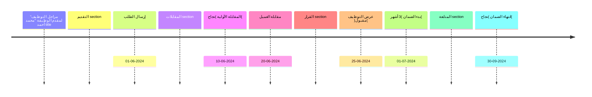

.)Admin – Client – HR – Applicant( ﺗﻔﺎﺻﯿﻞ ﻟﻜﻞ ﻧﻮع ﺣﺴﺎب •
.ﺷﺮح ﻟﻜﻞ ﺻﻔﺤﺔ وﻣﺎ ﺗﺤﺘﻮﯾﮫ •
.ﺷﺮح ﻟﻜﻞ زر: إذا ﺿﻐﻂ ﻣﺎذا ﯾﺤﺪث •
وﻣﺮاﺟﻌﺔ )Admin ﻣﺜﻞ( ﯾﻤﻜﻨﮫ إﻧﺸﺎء وظﺎﺋﻒ )Client( إﺿﺎﻓﺔ أن اﻟﻌﻤﯿﻞ •
.اﻟﻤﺮﺷﺤﯿﻦ اﻟﻤﺘﻘﺪﻣﯿﻦ ﻋﻠﯿﮭﺎ
أوﻻً: اﻟﺤﺴﺎﺑﺎت واﻟﺼﻼﺣﯿﺎت 📌
)Admin( اﻟﺤﺴﺎب اﻹداري .1 🔹
ﺻﻼﺣﯿﺎت ﻣﻄﻠﻘﺔ:
إﺿﺎﻓﺔ/ﺗﻌﺪﯾﻞ/ﺣﺬف )ﻋﻤﻼء – ﻣﻮظﻔﯿﻦ – ﻣﺮﺷﺤﯿﻦ – وظﺎﺋﻒ(.
ﺗﻌﯿﯿﻦ اﻟﺼﻼﺣﯿﺎت ﻟﻜﻞ ﺣﺴﺎب.
إدارة اﻟﻌﻘﻮد واﻹﯾﺮادات.
ﺗﻔﻌﯿﻞ/إﻟﻐﺎء أي ﺗﻜﺎﻣﻞ ﺧﺎرﺟﻲ )– Zapier – API – Workable
.(WhatsApp – Twilio
◦
◦
◦
◦
•
اﻟﺪاﺧﻠﻲ CRMأوﻻً: ﻣﻜﻮﻧﺎت ﻧﻈﺎم اﻟـ
)Clients( إدارة اﻟﻌﻤﻼء .
.إﺿﺎﻓﺔ وﺗﻌدﯾل ﺑﯾﺎﻧﺎت اﻟﻌﻣﻼء -
ﺗﺗﺑﻊ ﺣﺎﻟﺔ اﻟﻌﻣﯾل )ﺟدﯾد – ﺗﻔﺎوض – ﻣوﻗّﻊ – ﻏﯾر ﻣﮭﺗم( -
.
ﺣﻔظ اﻟﻌﻘود، اﻟﺗﻌﻠﯾﻘﺎت، واﻟﻣراﺳﻼت اﻟﻣرﺗﺑطﺔ ﺑﺎﻟﻌﻣﯾل -
.
)Users & Roles( ﺻﻼﺣﯿﺎت اﻟﻤﺴﺘﺨﺪﻣﯿﻦ .
.إﻧﺷﺎء ﺻﻼﺣﯾﺎت ﻣﺧﺗﻠﻔﺔ )ﻣدﯾر – ﻣوظف ﻣﺑﯾﻌﺎت – ﻣوظف ﺗوظﯾف( -
.ﺗﺗﺑﻊ أﻧﺷطﺔ اﻟﻣﺳﺗﺧدﻣﯾن داﺧل اﻟﻧظﺎم -
)Reports & Dashboards( اﻟﺘﻘﺎرﯾﺮ وﻟﻮﺣﺎت اﻟﻤﻌﻠﻮﻣﺎت .
ﻋدد اﻟوظﺎﺋف اﻟﻧﺷطﺔ واﻟﻣﻐﻠﻘﺔ -
.
◦
.ﻧﺳﺑﺔ ﻧﺟﺎح اﻟﺗوظﯾف -
.أداء ﻓرﯾق اﻟﺗوظﯾف أو اﻟﻣﺑﯾﻌﺎت -
)HR/Recruiter( ﺣﺴﺎب اﻟﻤﻮظﻒ اﻟﺪاﺧﻠﻲ .2 🔹
:ﻣﺴﺆول ﻋﻦ ﻣﺘﺎﺑﻌﺔ اﻟﺘﻮظﯿﻒ •
.إﻧﺸﺎء وظﺎﺋﻒ ﺟﺪﯾﺪة ◦
.إدارة اﻟﻤﺮﺷﺤﯿﻦ )ﻗﺒﻮل – رﻓﺾ – أرﺷﻔﺔ( ◦
.ﺟﺪوﻟﺔ اﻟﻤﻘﺎﺑﻼت وإرﺳﺎل اﻟﺘﺬﻛﯿﺮات ◦
.إرﺳﺎل اﻟﺴﯿﺮ اﻟﺬاﺗﯿﺔ ﻟﻠﻌﻤﯿﻞ ◦
.ﻣﺘﺎﺑﻌﺔ اﻟﺘﺎرﻏﺖ اﻟﺸﮭﺮي وﻣﺆﺷﺮات اﻷداء ◦
)Client Portal( ﺣﺴﺎب اﻟﻌﻤﯿﻞ .3 🔹
:ﻣﻤﯿﺰاﺗﮫ •
.)Admin ﻣﺜﻞ اﻟـ( إﻧﺸﺎء وظﺎﺋﻒ ﺟﺪﯾﺪة ◦
.اﻻطﻼع ﻋﻠﻰ اﻟﻤﺮﺷﺤﯿﻦ اﻟﻤﺘﻘﺪﻣﯿﻦ ﻟﻠﻮظﺎﺋﻒ اﻟﺨﺎﺻﺔ ﺑﮫ ◦
.)ﺗﻘﯿﯿﻢ – ﺗﺎرﯾﺦ اﻟﻤﻘﺎﺑﻼت – CV( ﻣﺸﺎھﺪة ﺗﻔﺎﺻﯿﻞ ﻛﻞ ﻣﺮﺷﺢ ◦
.ﻟﻜﻞ ﻣﺮﺷﺢ )ﻧﺠﺎح – رﻓﺾ – ﻣﻼﺣﻈﺎت( Feedback وﺿﻊ ◦
.طﻠﺐ وظﯿﻔﺔ ﺟﺪﯾﺪة ﻋﺒﺮ ﻧﻤﻮذج ﻣﺨﺼﺺ ◦
.ﻣﺘﺎﺑﻌﺔ اﻟﻌﻘﻮد واﻹﯾﺮادات اﻟﻤﺮﺗﺒﻄﺔ ﺑﮫ ◦
)Job Applicant( ﺣﺴﺎب ﻣﻘﺪم اﻟﻮظﯿﻔﺔ .4 🔹
.إﻧﺸﺎء ﺣﺴﺎب واﻟﺘﻘﺪﯾﻢ ﻋﻠﻰ اﻟﻮظﺎﺋﻒ •
.اﺳﺘﻌﺮاض اﻟﻮظﺎﺋﻒ )ﺑﻄﺎﻗﺎت أو ﺧﺮﯾﻄﺔ( •
.ﻣﺘﺎﺑﻌﺔ ﺣﺎﻟﺔ طﻠﺒﮫ ﻋﺒﺮ اﻟﺘﺎﯾﻢ ﻻﯾﻦ •
.)Withdraw( إﻟﻐﺎء طﻠﺒﮫ ﻓﻲ أي وﻗﺖ •
)Sales Representative( ﺗﻤﺎم 👌 ﺧﻠﯿﻨﺎ ﻧﺮﻛﺰ ﻋﻠﻰ ﺣﺴﺎب ﻣﻮظﻒ اﻟﻤﺒﯿﻌﺎت
وﻧﻜﺘﺐ ﻛﻞ ﺗﻔﺎﺻﯿﻞ ﻟﻮﺣﺔ اﻟﺘﺤﻜﻢ + اﻟﺼﻔﺤﺎت + اﻷزرار + اﻟﻤﮭﺎم اﻟﯿﻮﻣﯿﺔ.
واﻟﻌﻤﯿﻞ ﻷﻧﮫ ﻣﺴﺆول ﻋﻦ ﺟﻠﺐ اﻟﻌﻤﻼء + HR ھﺬا اﻟﺤﺴﺎب ﺑﯿﻜﻮن ﻣﺨﺘﻠﻒ ﻋﻦ
.ﺗﺴﺠﯿﻞ اﻟﻮظﺎﺋﻒ + ﻣﺘﺎﺑﻌﺔ اﻟﻌﻘﻮد + رﻓﻊ اﻹﯾﺮادات
Sales Representative( ﺣﺴﺎب ﻣﻮظﻒ اﻟﻤﺒﯿﻌﺎت 📌
Account)
اﻟﮭﺪف ﻣﻦ اﻟﺤﺴﺎب 🎯
إدارة دورة اﻟﻤﺒﯿﻌﺎت: ﻋﻤﯿﻞ → ﺗﻔﺎوض → ﺗﻮﻗﯿﻊ ﻋﻘﺪ → ﺗﺴﺠﯿﻞ وظﯿﻔﺔ •
.HR → ﺗﺴﻠﯿﻢ ﻟﻔﺮﯾﻖ
.ﻣﺘﺎﺑﻌﺔ اﻹﯾﺮادات واﻟﺘﺎرﻏﺖ اﻟﺸﮭﺮي •
.أرﺷﻔﺔ اﻟﻤﺮاﺳﻼت واﻟﻌﻘﻮد اﻟﻤﺮﺗﺒﻄﺔ ﺑﻜﻞ ﻋﻤﯿﻞ •
.ﺗﺴﺠﯿﻞ اﻟﻮظﺎﺋﻒ اﻟﻤﺒﺎﻋﺔ ﻣﻦ اﻟﻌﻤﯿﻞ ورﺑﻄﮭﺎ ﺑﺎﻟﻨﻈﺎم •
)Dashboard( ﻟﻮﺣﺔ اﻟﺘﺤﻜﻢ 🖥
:ﻋﻨﺪ ﺗﺴﺠﯿﻞ اﻟﺪﺧﻮل ﯾﻈﮭﺮ ﻟﻤﻮظﻒ اﻟﻤﺒﯿﻌﺎت
)ﻣﺆﺷﺮات اﻷداء – KPIs( اﻟﻘﺴﻢ اﻟﻌﻠﻮي 🔹
ﻋﺪد اﻟﻌﻤﻼء اﻟﺠﺪد ھﺬا اﻟﺸﮭﺮ •
.
ﻋﺪد اﻟﻮظﺎﺋﻒ اﻟﻤﺒﺎﻋﺔ •
.
.)AED / USD( إﺟﻤﺎﻟﻲ اﻟﻌﻘﻮد اﻟﻤﻮﻗﻌﺔ •
ﻧﺴﺒﺔ ﺗﺤﻘﯿﻖ اﻟﺘﺎرﻏﺖ )ﻣﺜﻼً 70%( •
.
.اﻟﻤﺆﺟﻠﺔ أو اﻟﻤﺘﺄﺧﺮة )Follow-ups( ﻋﺪد اﻟﻤﺘﺎﺑﻌﺎت •
)Sidebar( اﻟﻘﺎﺋﻤﺔ اﻟﺠﺎﻧﺒﯿﺔ 🔹
)Clients( اﻟﻌﻤﻼء .1
)Job Orders( اﻟﻮظﺎﺋﻒ .2
)Contracts( اﻟﻌﻘﻮد .3
)Revenue( اﻹﯾﺮادات .4
)Reminders( اﻟﺘﺬﻛﯿﺮات .5
)Archive( اﻷرﺷﯿﻒ .6
)Reports( اﻟﺘﻘﺎرﯾﺮ .7
ﺻﻔﺤﺎت اﻟﻨﻈﺎم اﻟﺨﺎﺻﺔ ﺑﻤﻮظﻒ اﻟﻤﺒﯿﻌﺎت 📑
)Clients Page( ﺻﻔﺤﺔ اﻟﻌﻤﻼء 1⃣
:اﻷزرار •
إدﺧﺎل ﻋﻤﯿﻞ ﺟﺪﯾﺪ )اﺳﻢ اﻟﺸﺮﻛﺔ – اﻟﺒﺮﯾﺪ – رﻗﻢ → Add Client + ◦
.– اﻟﺸﺨﺺ اﻟﻤﺴﺆول – اﻟﻘﻄﺎع(
ﻋﺮض ﺗﻔﺎﺻﯿﻞ اﻟﻌﻤﯿﻞ: اﻟﺤﺎﻟﺔ )ﺟﺪﯾﺪ – → ) 👁 اﻟﻌﯿﻦ( View ◦
ﺗﻔﺎوض – ﻣﻮﻗّﻊ – ﻏﯿﺮ ﻣﮭﺘﻢ(، اﻟﻌﻘﻮد، اﻟﺘﻌﻠﯿﻘﺎت، اﻟﻤﻠﻔﺎت
.
.ﺗﻌﺪﯾﻞ ﺑﯿﺎﻧﺎت اﻟﻌﻤﯿﻞ → Edit ◦
.ورﺑﻄﮫ ﺑﺎﻟﻌﻤﯿﻞ PDF رﻓﻊ ﻋﻘﺪ → Attach Contract ◦
.إﺿﺎﻓﺔ ﻣﻼﺣﻈﺔ ﻋﻦ اﺟﺘﻤﺎع أو ﻣﻜﺎﻟﻤﺔ → Add Note ◦
.ﺗﺬﻛﯿﺮ ﺑﺎﻟﺘﻮاﺻﻞ → Set Reminder ◦
.ﻣﺮاﺳﻠﺔ ﻣﺒﺎﺷﺮة ﻣﻦ اﻟﻨﻈﺎم → Send Email / WhatsApp ◦
:اﻟﺒﯿﺎﻧﺎت اﻟﻈﺎھﺮة ﻓﻲ اﻟﺠﺪول •
اﺳﻢ اﻟﻌﻤﯿﻞ | ﺣﺎﻟﺔ اﻟﻌﻤﯿﻞ | ﻋﺪد اﻟﻮظﺎﺋﻒ اﻟﻤﺮﺗﺒﻄﺔ | آﺧﺮ ﺗﻮاﺻﻞ | ◦
.) ❌/ ✔( اﻟﻌﻘﺪ اﻟﻤﺮﻓﻮع
)Job Orders Page( ﺻﻔﺤﺔ اﻟﻮظﺎﺋﻒ 2⃣
ﯾﻤﻜﻦ ﻟﻤﻮظﻒ اﻟﻤﺒﯿﻌﺎت إﺿﺎﻓﺔ وظﯿﻔﺔ ﺟﺪﯾﺪة ﻣﺮﺗﺒﻄﺔ ﺑﺎﻟﻌﻤﯿﻞ ﺑﻌﺪ ﺗﻮﻗﯿﻊ •
اﻟﻌﻘﺪ
.
:اﻷزرار •
إدﺧﺎل ﺗﻔﺎﺻﯿﻞ اﻟﻮظﯿﻔﺔ )اﻟﻤﺴﻤﻰ – اﻟﻮﺻﻒ – → Add Job + ◦
.اﻟﺮاﺗﺐ – اﻟﻤﻮﻗﻊ – ﻋﺪد اﻟﻤﺮﺷﺤﯿﻦ اﻟﻤﻄﻠﻮﺑﯿﻦ(
ﯾﻤﻜﻦ )HR ﺑﻌﺪ رﺑﻂ اﻟﻮظﯿﻔﺔ ﺑﻔﺮﯾﻖ( → View Candidates ◦
ﻣﺸﺎھﺪة اﻟﻤﺮﺷﺤﯿﻦ اﻟﻤﻘﺪﻣﯿﻦ
.
.ﺗﻌﺪﯾﻞ ﺗﻔﺎﺻﯿﻞ اﻟﻮظﯿﻔﺔ → Edit Job ◦
.إﻏﻼق اﻟﻮظﯿﻔﺔ ﺑﻌﺪ اﻛﺘﻤﺎل اﻟﺘﻮظﯿﻒ → Close Job ◦
:اﻟﺠﺪول •
اﻟﻮظﯿﻔﺔ | اﻟﻌﻤﯿﻞ | اﻟﺤﺎﻟﺔ )ﻧﺸﻄﺔ – ﻣﻐﻠﻘﺔ – ﺗﻢ اﻟﺘﻮظﯿﻒ( | ﻋﺪد ◦
.اﻟﻤﺮﺷﺤﯿﻦ | ﺗﺎرﯾﺦ اﻹﻧﺸﺎء
)Contracts Page( ﺻﻔﺤﺔ اﻟﻌﻘﻮد 3⃣
:اﻷزرار •
.إﻧﺸﺎء ﻋﻘﺪ ﺟﺪﯾﺪ ﻟﻠﻌﻤﯿﻞ → New Contract + ◦
اﺳﺘﻌﺮاض اﻟﻌﻘﺪ )ﺗﻔﺎﻋﻠﻲ ﻣﻊ ﺣﻘﻮل → ) 👁( View Contract ◦
.ﻣﺘﻐﯿﺮة(
.ﺗﻌﺪﯾﻞ ﺑﻨﻮد اﻟﻌﻘﺪ → Edit Contract ◦
.ﺗﺤﻤﯿﻞ ﻧﺴﺨﺔ رﺳﻤﯿﺔ → Download PDF ◦
◦ Send to Client → إرﺳﺎل ﻋﺒﺮ اﻟﺒﺮﯾﺪ أو WhatsApp.
:ﺗﻔﺎﺻﯿﻞ اﻟﻌﻘﺪ •
رﻗﻢ اﻟﻌﻘﺪ | اﻟﻌﻤﯿﻞ | اﻟﻘﯿﻤﺔ )ﺑﺎﻟﻌﻤﻠﺔ اﻟﻤﺨﺘﺎرة( | ﺗﺎرﯾﺦ اﻟﺒﺪء | ﺗﺎرﯾﺦ ◦
.اﻻﻧﺘﮭﺎء | ﻣﺮﻓﻘﺎت
)Revenue Page( ﺻﻔﺤﺔ اﻹﯾﺮادات 4⃣
.ﻋﺮض اﻹﯾﺮادات اﻟﻨﺎﺗﺠﺔ ﻋﻦ اﻟﻌﻘﻮد اﻟﻤﻐﻠﻘﺔ •
:اﻷزرار •
ﺗﺴﺠﯿﻞ دﻓﻌﺔ ﺟﺪﯾﺪة )ﺗﺎرﯾﺦ – ﻣﺒﻠﻎ – وﺳﯿﻠﺔ → Add Payment + ◦
.دﻓﻊ(
◦ Convert Currency → ﺗﺤﻮﯾﻞ اﻟﻌﻤﻠﺔ (AED ⇄ USD).
.ﺗﻨﺰﯾﻞ ﺗﻘﺮﯾﺮ ﻣﺎﻟﻲ → Export CSV / Excel ◦
:اﻟﺠﺪول •
اﻟﻌﻤﯿﻞ | رﻗﻢ اﻟﻌﻘﺪ | اﻟﻤﺒﻠﻎ | اﻟﺤﺎﻟﺔ )ﻣﺪﻓﻮع/ﺟﺰﺋﻲ/ﻣﻌﻠﻖ( | وﺳﯿﻠﺔ ◦
.اﻟﺪﻓﻊ
)Reminders( ﺻﻔﺤﺔ اﻟﺘﺬﻛﯿﺮات 5⃣
:اﻷزرار •
.إﺿﺎﻓﺔ ﺗﺬﻛﯿﺮ ﺟﺪﯾﺪ → Add Reminder + ◦
.إﺗﻤﺎم اﻟﺘﺬﻛﯿﺮ → Mark as Done ◦
.ﺗﺄﺟﯿﻞ اﻟﺘﺬﻛﯿﺮ ﻟﯿﻮم آﺧﺮ → Snooze ◦
:اﻟﺠﺪول •
.اﻟﺘﺎرﯾﺦ | اﻟﻌﻤﯿﻞ | اﻟﻮﺻﻒ | اﻟﺤﺎﻟﺔ )ﻣﻔﺘﻮح – ﻣﻜﺘﻤﻞ – ﻣﺘﺄﺧﺮ( ◦
)Archive( ﺻﻔﺤﺔ اﻷرﺷﯿﻒ 6⃣
ﺣﻔﻆ ﻛﻞ اﻟﻤﻠﻔﺎت واﻟﻤﺴﺘﻨﺪات اﻟﻤﺮﺗﺒﻄﺔ ﺑﺎﻟﻌﻤﻼء أو اﻟﻌﻘﻮد •
.
:اﻷزرار •
.رﻓﻊ ﻣﺴﺘﻨﺪ ﺟﺪﯾﺪ → Upload Document + ◦
.اﻟﺒﺤﺚ ﺑﺎﺳﻢ اﻟﻌﻤﯿﻞ أو اﻟﻤﻠﻒ → Search ◦
.ﺗﻨﺰﯾﻞ اﻟﻤﻠﻒ → Download ◦
)Reports Page( ﺻﻔﺤﺔ اﻟﺘﻘﺎرﯾﺮ 7⃣
:أﻧﻮاع اﻟﺘﻘﺎرﯾﺮ •
.اﻟﻌﻤﻼء اﻟﺠﺪد ﺧﻼل اﻟﺸﮭﺮ ◦
.اﻟﻌﻘﻮد اﻟﻤﻐﻠﻘﺔ ◦
.اﻹﯾﺮادات ﺣﺴﺐ اﻟﻌﻤﯿﻞ ◦
.اﻟﻮظﺎﺋﻒ اﻟﻤﺒﺎﻋﺔ ﺣﺴﺐ اﻟﻘﻄﺎع ◦
:اﻷزرار •
.ﺗﻨﺰﯾﻞ اﻟﺘﻘﺮﯾﺮ → Export PDF/Excel ◦
.ﻓﻠﺘﺮة ﺣﺴﺐ اﻟﻔﺘﺮة أو اﻟﻌﻤﯿﻞ → Filter ◦
اﻟﺘﺎﯾﻢ ﻻﯾﻦ اﻟﺨﺎص ﺑﻤﺒﯿﻌﺎت اﻟﻤﻮظﻒ 🔄
إﺿﺎﻓﺔ ﻋﻤﯿﻞ ﺟﺪﯾﺪ .1
⬇
اﻟﺘﻮاﺻﻞ واﻟﺘﻔﺎوض )ﻣﻜﺎﻟﻤﺎت – اﺟﺘﻤﺎﻋﺎت – ﻋﺮوض( .2
⬇
رﻓﻊ ﻋﻘﺪ ورﺑﻄﮫ ﺑﺎﻟﻌﻤﯿﻞ .3
⬇
إﺿﺎﻓﺔ وظﯿﻔﺔ ﺟﺪﯾﺪة ﻟﻠﻌﻤﯿﻞ .4
⬇
HR ﻣﺘﺎﺑﻌﺔ اﻟﻮظﯿﻔﺔ ﻣﻊ .5
⬇
ﺗﺴﺠﯿﻞ اﻹﯾﺮادات ﺑﻌﺪ اﻟﺪﻓﻊ .6
⬇
إﻏﻼق اﻟﺼﻔﻘﺔ ورﻓﻊ ﺗﻘﺮﯾﺮ اﻷداء .7
ﺛﺎﻧﯿﺎً: اﻟﺼﻔﺤﺎت اﻟﺮﺋﯿﺴﯿﺔ وﺷﺮح اﻷزرار 📌
)Jobs Page( ﺻﻔﺤﺔ اﻟﻮظﺎﺋﻒ .1
)Admin – Client – HR – Applicant( :ﻟﻠﻤﺴﺘﺨﺪﻣﯿﻦ
:ﻋﺮض اﻟﻮظﺎﺋﻒ •
.)Map( أو ﻋﻠﻰ اﻟﺨﺮﯾﻄﺔ )Cards( ﻋﻠﻰ ﺷﻜﻞ ﺑﻄﺎﻗﺎت ◦
ﻛﻞ ﺑﻄﺎﻗﺔ ﺗﺤﺘﻮي: )ﻋﻨﻮان اﻟﻮظﯿﻔﺔ – اﻟﺸﺮﻛﺔ – اﻟﻤﻮﻗﻊ – اﻟﺮاﺗﺐ – ◦
.زر اﻟﺘﻔﺎﺻﯿﻞ(
:اﻷزرار •
.ﻟﻠﻤﺮﺷﺢ ﻓﻘﻂ: ﯾﻔﺘﺢ ﻧﻤﻮذج اﻟﺘﻘﺪﯾﻢ – )ﺗﻘﺪﯾﻢ( Apply زر ◦
ﯾﺤﻮل اﻟﻌﺮض إﻟﻰ ﺧﺮﯾﻄﺔ – )ﻋﺮض اﻟﺨﺮﯾﻄﺔ( Show Map زر ◦
.ﺗﻔﺎﻋﻠﯿﺔ
.ﺧﯿﺎرات )ﻣﺠﺎل، ﻣﻮﻗﻊ، راﺗﺐ( – )ﻓﻠﺘﺮة( Filter زر ◦
.ﻣﺴﺢ اﻟﻔﻼﺗﺮ – )إﻋﺎدة ﺗﻌﯿﯿﻦ( Reset زر ◦
Admin + Client( ﯾﻈﮭﺮ ﻓﻘﻂ ﻟـ – )وظﯿﻔﺔ ﺟﺪﯾﺪة( New Job زر ◦
.ﯾﻔﺘﺢ ﻧﺎﻓﺬة ﻹﻧﺸﺎء وظﯿﻔﺔ :)HR +
)Candidates Page( ﺻﻔﺤﺔ اﻟﻤﺮﺷﺤﯿﻦ .2
)Admin – Client – HR( :ﻟﻠﻤﺴﺘﺨﺪﻣﯿﻦ
.ﻋﺮض ﺟﻤﯿﻊ اﻟﻤﺮﺷﺤﯿﻦ ﻟﻠﻮظﺎﺋﻒ اﻟﻤﺨﺘﺎرة •
.اﻟﺘﻔﺎﺻﯿﻞ: )اﺳﻢ، ﺳﯿﺮة ذاﺗﯿﺔ، ﺧﺒﺮات، ﻣﮭﺎرات، ﺗﻘﯿﯿﻢ، ﺣﺎﻟﺔ اﻟﻄﻠﺐ( •
:اﻷزرار •
.ﻓﺘﺢ اﻟﺴﯿﺮة اﻟﺬاﺗﯿﺔ → View CV زر ◦
.وﺿﻊ ﺗﻘﯿﯿﻢ داﺧﻠﻲ أو ﻣﻼﺣﻈﺎت → )ﺗﻘﯿﯿﻢ( Evaluate زر ◦
إرﺳﺎل ﺑﯿﺎﻧﺎت اﻟﻤﺮﺷﺢ ﻟﻠﻌﻤﯿﻞ → )ﻓﻘﻂ Send to Client (HR زر ◦
.ﻣﻊ ﺗﺘﺒﻊ اﻟﺮد
وﺿﻊ اﻟﻔﯿﺪﺑﺎك → )ﻓﻘﻂ Feedback (Feedback) (Client زر ◦
.)ﻣﻘﺒﻮل، ﻣﺮﻓﻮض، ﯾﺤﺘﺎج ﻣﻘﺎﺑﻠﺔ(
.ﻧﻘﻞ اﻟﻤﺮﺷﺢ ﻟﻸرﺷﯿﻒ → )أرﺷﻔﺔ( Archive زر ◦
)Interviews Page( ﺻﻔﺤﺔ اﻟﻤﻘﺎﺑﻼت .3
)Admin – HR – Client( :ﻟﻠﻤﺴﺘﺨﺪﻣﯿﻦ
.ﻋﺮض اﻟﻤﻘﺎﺑﻼت اﻟﻤﺠﺪوﻟﺔ ﺣﺴﺐ اﻟﻮظﺎﺋﻒ واﻟﻤﺮﺷﺤﯿﻦ •
:اﻷزرار •
ﺗﺤﺪﯾﺪ ﺗﺎرﯾﺦ/وﻗﺖ + إرﺳﺎل → Schedule Interview زر ◦
.دﻋﻮات ﻋﺒﺮ اﻟﺒﺮﯾﺪ/واﺗﺴﺎب
.إرﺳﺎل ﺗﺬﻛﯿﺮ ﻋﺒﺮ اﻟﻮاﺗﺴﺎب/اﻟﺒﺮﯾﺪ → Send Reminder زر ◦
.ﺗﺴﺠﯿﻞ اﻟﻤﻘﺎﺑﻠﺔ وﺣﻔﻈﮭﺎ → Record Interview زر ◦
.إرﺳﺎل رﺳﺎﻟﺔ ﺷﻜﺮ آﻟﯿﺔ ﻋﻨﺪ اﻟﺮﻓﺾ → Send Rejection زر ◦
ﺗﺄﻛﯿﺪ ﺣﻀﻮر → )Confirm Attendance (Client/HR زر ◦
.اﻟﻤﻘﺎﺑﻠﺔ
)Contracts Page( ﺻﻔﺤﺔ اﻟﻌﻘﻮد .4
أ. ﻋﻘﻮد اﻟﻤﻮظﻔﯿﻦ
.ﻋﺮض اﻟﻌﻘﻮد اﻟﻤﻮﻗﻌﺔ ﻣﻊ اﻟﻤﻮظﻔﯿﻦ •
.)AED ﺑﻤﺎ ﻓﯿﮭﺎ( دﻋﻢ ﻋﻤﻼت ﻣﺘﻌﺪدة •
:اﻷزرار •
.ﻋﺮض ﻧﺴﺨﺔ ﺗﻔﺎﻋﻠﯿﺔ → View ◦
.ﻓﺘﺢ ﻣﺤﺮر اﻟﻨﺼﻮص → Edit ◦
◦ Download → ﺗﻨﺰﯾﻞ PDF.
.ﺗﺤﻮﯾﻞ اﻟﻌﻤﻠﺔ → Convert Currency ◦
ب. ﻋﻘﻮد اﻟﺸﺮﻛﺎت
ﻧﻔﺲ ﺧﯿﺎرات اﻟﻤﻮظﻔﯿﻦ + زر إﺿﺎﻓﻲ:
Stripe –) رﺑﻂ اﻟﻌﻘﺪ ﺑﻮﺳﯿﻠﺔ دﻓﻊ → Link Payment Method
◦
.(Wire – PayPal
ﯾﻤﻜﻦ ﻋﺪم رﺑﻄﮫ اﯾﻀﺎً ﺑﺤﯿﺚ ﯾﺘﻢ اﻟﺪﻓﻊ ﻋﻦ طﺮﯾﻖ ﻓﯿﺰا او اﺑﻞ ﺑﻲ او
◦
ﻏﯿﺮھﺎ
)Clients Page( ﺻﻔﺤﺔ اﻟﻌﻤﻼء .5
)Admin – HR – Client( :ﻟﻠﻤﺴﺘﺨﺪﻣﯿﻦ
ﻛﺮوت اﻟﺸﺮﻛﺎت: ﺗﻌﺮض )اﻟﻮظﺎﺋﻒ اﻟﻤﻔﺘﻮﺣﺔ – ﻋﺪد اﻟﻤﺘﻘﺪﻣﯿﻦ – ﺣﺎﻟﺔ •
.اﻟﻤﺮﺷﺤﯿﻦ(
:اﻷزرار •
إظﮭﺎر ﻗﺎﺋﻤﺔ ﺗﻔﺼﯿﻠﯿﺔ ﻟﻠﻤﺮﺷﺤﯿﻦ )ﻣﻘﺒﻮﻟﯿﻦ – → View Details ◦
.ﻣﺮﻓﻮﺿﯿﻦ – ﺗﺤﺖ اﻟﻤﺮاﺟﻌﺔ(
.إدﺧﺎل ﺗﻘﯿﯿﻢ اﻟﻌﻤﯿﻞ ﻟﻜﻞ ﻣﺮﺷﺢ → Feedback ◦
ﺗﺼﻔﯿﺔ اﻟﻤﻘﺒﻮﻟﯿﻦ ﺣﺴﺐ اﻟﻤﮭﺎرة/اﻟﻠﻐﺔ/ → Filter Candidates ◦
.اﻟﺨﺒﺮة
•
)Revenue Page( ﺻﻔﺤﺔ اﻹﯾﺮادات .6
ﯾﻤﻜﻦ ﺗﺨﺼﯿﺺ اﻟﺒﺎﻗﺎت ﺳﻮاء ﻻﻓﺮاد او اﻟﻜﻼﯾﻨﺖ )اﻟﺸﺮﻛﺎت( ﻛﻤﺎ
ھﻮ ﻣﻮﺟﻮد ﺣﺎﻟﯿﺎ
.ﺳﺤﺐ اﻟﺸﺮﻛﺔ ووﺿﻌﮭﺎ ﻋﻠﻰ وﺳﯿﻠﺔ دﻓﻊ :Drag & Drop واﺟﮭﺔ •
:اﻷزرار •
.إﺿﺎﻓﺔ وﺳﯿﻠﺔ دﻓﻊ ﺟﺪﯾﺪة → Add Payment Method ◦
.ﺗﻌﺪﯾﻞ اﻟﺮﺑﻂ ﺑﯿﻦ اﻟﺸﺮﻛﺔ واﻟﻄﺮﯾﻘﺔ → Update Link ◦
.ﻋﺮض ﺗﺎرﯾﺦ اﻟﻤﺪﻓﻮﻋﺎت → View History ◦
)Timeline Page( ﺻﻔﺤﺔ اﻟﺘﺎﯾﻢ ﻻﯾﻦ .7
ﯾﻤﻜﻦ ﻷدﻣﻦ ﺗﺨﺼﯿﺺ اﻟﺘﺎﯾﻢ ﻻﯾﻦ ﺑﺤﯿﺚ ﯾﻀﯿﻒ او ﯾﻠﻐﻲ ﺧﻄﻮة
ﺣﺴﺐ ﻣﺎ ﯾﺮي وﺗﺨﺼﯿﺺ ﻣﺪة اﻟﻀﻤﺎن ﺣﺴﺐ اﻟﺮﻏﺒﮫ
:ﻟﻜﻞ ﻣﺮﺷﺢ ﯾﻈﮭﺮ ﺧﻂ زﻣﻨﻲ •
اﻟﺘﻘﺪﯾﻢ → ﻣﻘﺎﺑﻠﺔ أوﻟﯿﺔ → ﻣﻘﺎﺑﻠﺔ ﻋﻤﯿﻞ → ﻋﺮض وظﯿﻔﻲ → ﻓﺘﺮة ◦
.اﻟﻀﻤﺎن
:اﻷزرار •
.ﻋﺮض اﻟﻤﺮاﺣﻞ → View Progress ◦
إﺿﺎﻓﺔ ﻣﺮﺣﻠﺔ ﺟﺪﯾﺪة )اﺧﺘﺒﺎر ﻓﻨﻲ، → )Add Stage (Admin/HR ◦
.ﻣﻘﺎﺑﻠﺔ ﺛﺎﻧﯿﺔ(
.إﺷﻌﺎر اﻟﻤﺮﺷﺢ ﺑﺘﺤﺪﯾﺚ اﻟﻤﺮﺣﻠﺔ → Notify Candidate ◦
)Video Meeting Module( ﺻﻔﺤﺔ اﻟﻔﯿﺪﯾﻮ .8
:اﻷزرار •
◦ Start Call → ﺑﺪء ﻣﻜﺎﻟﻤﺔ WebRTC.
.ﻣﺸﺎرﻛﺔ اﻟﺸﺎﺷﺔ → Share Screen ◦
.ﺗﺴﺠﯿﻞ اﻟﺠﻠﺴﺔ → Record ◦
◦ Use Twilio → ﺗﻔﻌﯿﻞ ﻣﻜﺎﻟﻤﺎت ﻋﺒﺮ Twilio.
)WhatsApp Integration( ﺗﻜﺎﻣﻞ اﻟﻮاﺗﺴﺎب .9
:اﻷزرار •
.ﺗﺬﻛﯿﺮ ﺑﺎﻟﻤﻘﺎﺑﻠﺔ → Send Reminder ◦
.ﻓﺘﺢ دردﺷﺔ ﻣﺒﺎﺷﺮة ﻣﻊ اﻟﻤﺮﺷﺢ → Open Chat ◦
.اﻗﺘﺮاح ردود ﺟﺎھﺰة ﺑﺎﻟﺬﻛﺎء اﻻﺻﻄﻨﺎﻋﻲ → Smart Reply ◦
ﺑﻌﺪ إﺿﺎﻓﺔ )Workflow( ﺛﺎﻟﺜﺎً: ﺗﺪﻓﻖ اﻟﻌﻤﻠﯿﺔ 📌
""إﻧﺸﺎء وظﯿﻔﺔ ﻣﻦ اﻟﻌﻤﯿﻞ
1. Admin
.ﯾﻨﺸﺊ وظﯿﻔﺔ ﺟﺪﯾﺪة أو ﯾﻌﻄﻲ ﺻﻼﺣﯿﺔ ﻟﻠﻌﻤﯿﻞ ﺑﺈﻧﺸﺎﺋﮭﺎ ⬇
2. Client
.Feedback ﯾﻨﺸﺊ وظﯿﻔﺔ → ﯾﺸﺎھﺪ اﻟﻤﺮﺷﺤﯿﻦ اﻟﻤﺘﻘﺪﻣﯿﻦ → ﯾﻌﻄﻲ ⬇
3. HR
.ﯾﺘﺎﺑﻊ اﻟﻤﺮﺷﺤﯿﻦ → ﯾﺮﺷﺢ اﻷﻓﻀﻞ ﻟﻠﻌﻤﯿﻞ → ﯾﻨﻈﻢ اﻟﻤﻘﺎﺑﻼت ⬇
4. Applicant
.ﯾﻘﺪم ﻋﻠﻰ اﻟﻮظﯿﻔﺔ → ﯾﺘﺎﺑﻊ ﻋﺒﺮ اﻟﺘﺎﯾﻢ ﻻﯾﻦ → ﯾﺴﺘﻠﻢ إﺷﻌﺎرات ⬇
5. System
.ﯾﺨﺰن ﻛﻞ ﺷﻲء )ﻋﻘﻮد – ﻣﻘﺎﺑﻼت – ﻓﯿﺪﺑﺎك – إﯾﺮادات( ⬇

! Pre-login Pages
1. Homepage
◦ Company overview, services, and mission
◦ Language switcher (RTL support for Arabic)
◦ Contact links: WhatsApp, LinkedIn, Instagram, X,
Website
◦ CTA: “Create Account” / “Login”
2. Showcase Page
◦ Display all partnered companies
◦ Company logos, industry, city, country
◦ Filter by: industry, city, country
◦ Show map (Google Maps or Leaflet) with company
locations
" Authentication
• Signup / Login with email + password
• Role selection: Admin, HR, Client, Recruiter
• Email verification (optional)
• Password reset
• Multilingual login UI
# CRM Features
1. Client Management
◦ Add/edit/delete clients
◦ Status: New, Negotiation, Signed, Inactive
◦ Store contracts, notes, attachments
◦ Visual company cards + map view
2. Job Orders
◦ Create job posts linked to clients
◦ Status: Active, Closed, Hired
◦ Send notifications on updates
3. Billing System
◦ Auto-generate invoices after hiring
◦ Link invoices to job + client
◦ Payment status: Paid, Partial, Unpaid
◦ Export PDF invoices
◦ Payment options: Stripe, Wire Transfer
$ ATS Features
1. Candidate Management
◦ Add/edit candidates with CV, skills, experience
◦ Attachments, comments, evaluation logs
◦ Status: Contacted, Interviewing, Offered, Rejected,
Hired
2. AI Matching Engine
◦ Local model parses resumes and matches to job posts
◦ Display candidate-job match score
◦ Auto-rank candidates for each job
◦ Summarize resume using LLM
◦ Fallback to GPT-4 / Gemini if needed
3. Pipeline Visualization
◦ Dashboard showing:
▪ Total applicants
▪ Hired
▪ In progress
▪ Rejected
▪ Awaiting final client decision
▪ Hires per client
▪ Success %
▪ Contract status
▪ Outstanding revenue
% Interview Workflow
• Recruiters schedule interviews inside the system
• System sends calendar invites to candidates and clients
via email / WhatsApp
• Interview stages:
1. Internal Screening
2. Client Interview
3. Final Interview / Offer
• Auto-send thank-you message if rejected
• Auto-schedule backup candidate if main candidate fails
• Guarantee period (3/6 months): if hire fails, replace
candidate automatically
& Video Meeting Module (Built-in, No 3rd Party)
• Built using WebRTC with custom UI
• Audio / video / chat / screen share
• Internal and client interviews
• Auto-record sessions
• Link to candidate/job automatically
• Optional Twilio fallback if network is unstable
' WhatsApp Integration
• WhatsApp Business API for:
◦ Interview reminders
◦ Job updates
◦ Feedback requests
• Two-way chat with candidate inside platform
• AI WhatsApp chatbot (supports 5 languages)
( Dashboards
1. Admin Dashboard
◦ Users overview
◦ KPIs: total jobs, active clients, revenue
◦ Team activity and audit logs
2. HR Dashboard
◦ Candidate pipeline
◦ Tasks and reminders
◦ Daily communication log
3. Client Dashboard
◦ View only jobs and candidates related to client
◦ Rate candidates
◦ Request interviews
◦ Download resumes and invoices
) Local AI + Cloud Integration
1. Local Model (Open-Source)
◦ Deploy LLaMA 2 / Mistral locally
◦ Use for resume parsing, skill extraction, summary
generation
2. Cloud Providers (Optional)
◦ GPT-4, Gemini, Copilot — used only if local model
is insufficient
◦ Smart routing engine: local first → fallback to cloud
◦ Cost tracker and daily budget limit
3. Use Cases
◦ Parse resumes
◦ Match job-to-candidate
◦ Generate interview summaries
◦ Skill gap analysis
* Internationalization
• Full UI translation using i18n
• Languages: Arabic (RTL), English, French, Spanish, Urdu
• Language switcher at top-right
• All PDFs, invoices, notifications respect selected
language
• RTL layout for Arabic only
• Date/time format adjusts per region
+ Security
• JWT + Refresh tokens
• Role-based access control (Admin, HR, Client, Recruiter)
• Secure document access (CVs, contracts)
• Audit logs for all critical actions
• Rate-limiting on login and AI endpoints
, File & Data Handling
• Upload & store: CVs, PDFs, interview recordings
• Link files to candidates, jobs, clients
• Full search across candidates and jobs
• Export data to Excel/PDF
⚙ Technologies Summary
Area Stack / Tool
Frontend Next.js 14, Tailwind CSS, Shadcn/ui
Backend NestJS, Prisma, PostgreSQL
Auth JWT, Role-based access, Refresh tokens
AI Engine LLaMA/Mistral (local) + GPT-4/
Gemini
Video Calls WebRTC + Twilio fallback
Messaging WhatsApp Business API, Email, SMS
Deploymen
t Docker, CI/CD ready
i18n i18n-next, JSON translation files
Maps Google Maps or Leaflet.js
. Output
The final system should be:
• Modular
• Scalable
• Easy to extend
• Mobile-friendly
• RTL-compatible
• AI-ready
• Ready for full deployment
**اﻟﺒﺮوﻣﺒﺖ اﻟﺸﺎﻣﻞ ﻟﻤﻨﺼﺔ اﻟﺘﻮظﯿﻒ اﻟﺬﻛﯿﺔ** ###
ﻣﻨﺎﺳﺐ ﻟﻠﺠﻮال واﻟﻼﺑﺘﻮب ﺑﺎﻟﻜﺎﻣﻞ
)Design Colors( أﻟﻮان اﻟﺘﺼﻤﯿﻢ ##
| اﻻﺳﺘﺨﺪام | )HEX( اﻟﻌﻨﺼﺮ | اﻟﻠﻮن |
| ---------------------------------- | ----------- | -------------- |
| ﺧﻠﻔﯿﺔ اﻟﺼﻔﺤﺔ اﻟﺮﺋﯿﺴﯿﺔ | `C0322D#` | اﻷﺣﻤﺮ اﻟﺪاﻛﻦ |
| اﻷﺳﻮد اﻟﻔﺎﺣﻢ | `#111111` | ﺧﻠﻔﯿﺔ اﻟﻘﺎﺋﻤﺔ اﻟﺠﺎﻧﺒﯿﺔ )اﻟﮭﺎﻣﺒﺮﻏﺮ( |
| ﻧﺼﻮص اﻟﻘﺎﺋﻤﺔ | `FFFFFF#` | اﻷﺑﯿﺾ |
| اﻟﻨﺺ اﻟﺮﺋﯿﺴﻲ ﻓﻲ اﻟﺼﻔﺤﺔ | `F28C86#` | اﻟﺮﻣﺎدي اﻟﻔﺎﺗﺢ |
| ﺟﺰء ﻣﻦ اﻟﺸﻌﺎر | `A2A46اﻷزرق اﻟﺪاﻛﻦ | `#1 |
| ﺟﺰء ﻣﻦ اﻟﺸﻌﺎر واﻷزرار اﻟﺘﻔﺎﻋﻠﯿﺔ | `C1352F#` | اﻷﺣﻤﺮ اﻟﻐﺎﻣﻖ |
---
**)Showcase Page( ﺻﻔﺤﺔ اﻟﻌﺮوض .1** ###
.اﻟﻮﺻﻒ:** ﺗﻌﺮض ﺟﻤﯿﻊ اﻟﺸﺮﻛﺎت اﻟﺸﺮﯾﻜﺔ ﻣﻊ إﻣﻜﺎﻧﯿﺔ اﻟﺘﺼﻔﯿﺔ واﻟﺒﺤﺚ**
**:اﻷزرار واﻟﻤﻜﻮﻧﺎت**
**:)Filter Bar( ﺷﺮﯾﻂ اﻟﺘﺼﻔﯿﺔ** -
ﻗﺎﺋﻤﺔ ﻣﻨﺴﺪﻟﺔ ﻟﻠﺘﺼﻔﯿﺔ ﺣﺴﺐ اﻟﻘﻄﺎع *:)Industry( اﻟﺼﻨﺎﻋﺔ* -
.
.ﺣﻘﻞ ﺑﺤﺚ أو ﻗﺎﺋﻤﺔ ﻣﻨﺴﺪﻟﺔ *:)Country( اﻟﺪوﻟﺔ / )City( اﻟﻤﺪﯾﻨﺔ* -
.ﯾُﻈﮭﺮ اﻟﺸﺮﻛﺎت اﻟﻤﻄﺎﺑﻘﺔ *:)Apply( "زر "ﺗﻄﺒﯿﻖ* -
.ﯾﺰﯾﻞ ﺟﻤﯿﻊ اﻟﻔﻼﺗﺮ **:)Reset( "زر "إﻋﺎدة ﺗﻌﯿﯿﻦ** -
**:)Show Map( "زر "ﻋﺮض اﻟﺨﺮﯾﻄﺔ** -
Google( ﻋﻨﺪ اﻟﻀﻐﻂ:* ﯾﺤﻮل اﻟﻌﺮض ﻣﻦ اﻟﻘﺎﺋﻤﺔ إﻟﻰ ﺧﺮﯾﻄﺔ ﺗﻔﺎﻋﻠﯿﺔ* -
ﺗُﻈﮭﺮ ﻣﻮاﻗﻊ اﻟﺸﺮﻛﺎت )Maps/Leaflet
.
ﻣﻊ اﺳﻢ اﻟﺸﺮﻛﺔ )Markers( وظﯿﻔﺘﮫ:* ﻋﺮض ﻣﻮاﻗﻊ اﻟﺸﺮﻛﺎت ﺑﻌﻼﻣﺎت* -
.واﻟﻘﻄﺎع ﻋﻨﺪ اﻟﻨﻘﺮ
**:)Company Cards( ﺑﻄﺎﻗﺎت اﻟﺸﺮﻛﺎت** -
.ﺗﺤﺘﻮي:* ﺷﻌﺎر اﻟﺸﺮﻛﺔ، اﻟﻘﻄﺎع، اﻟﻤﺪﯾﻨﺔ، اﻟﺪوﻟﺔ* -
ﻋﻨﺪ اﻟﻨﻘﺮ:* ﯾُﻔﺘﺢ ﻧﻤﻮذج ﺑﺘﻔﺎﺻﯿﻞ اﻟﺘﻮاﺻﻞ واﻟﻮظﺎﺋﻒ اﻟﺸﺎﻏﺮة* -
.
---
**)Authentication( اﻟﻤﺼﺎدﻗﺔ .2** ###
**:ﺻﻔﺤﺎت اﻟﻤﺴﺘﺨﺪم**
. ﺗﺴﺠﯿﻞ اﻟﺪﺧﻮل** ####
**:)Login( أ
.اﻟﺤﻘﻮل:** إﯾﻤﯿﻞ، ﻛﻠﻤﺔ ﻣﺮور** -
**:اﻷزرار** -
ﯾﺘﺤﻘﻖ ﻣﻦ اﻟﺒﯿﺎﻧﺎت وﯾﻨﻘﻞ ﻟﻠﺪاﺷﺒﻮرد ﺣﺴﺐ *:)Login( "ﺗﺴﺠﯿﻞ اﻟﺪﺧﻮل"* -
.اﻟﺪور
ﯾﻔﺘﺢ ﻧﻤﻮذج إﻋﺎدة ﺗﻌﯿﯿﻦ *:)?Forgot Password( "ﻧﺴﯿﺖ ﻛﻠﻤﺔ اﻟﻤﺮور؟"* -
ﻛﻠﻤﺔ اﻟﻤﺮور
.
ﻗﺎﺋﻤﺔ ﻣﻨﺴﺪﻟﺔ )ﻋﺮﺑﻲ، إﻧﺠﻠﯿﺰي، ﻓﺮﻧﺴﻲ، *:)Language( "ﺗﻐﯿﯿﺮ اﻟﻠﻐﺔ"* -
.إﺳﺒﺎﻧﻲ، أردو(
**:)Signup( ب. اﻟﺘﺴﺠﯿﻞ** ####
.اﻟﺤﻘﻮل:** إﯾﻤﯿﻞ، ﻛﻠﻤﺔ ﻣﺮور، ﺗﺄﻛﯿﺪ ﻛﻠﻤﺔ اﻟﻤﺮور** -
**:اﻷزرار** -
ﻗﺎﺋﻤﺔ ﻣﻨﺴﺪﻟﺔ )ﻣﺴﺆول، ﻣﻮارد ﺑﺸﺮﯾﺔ، ﻋﻤﯿﻞ، *:)Role( "اﺧﺘﺮ دورك"* -
.ﻣﺴﺆول ﺗﻮظﯿﻒ(
ﯾُﺮﺳﻞ راﺑﻂ ﺗﺤﻘﻖ ﻟﻺﯾﻤﯿﻞ )اﺧﺘﯿﺎري( وﯾﻨﻘﻞ *:)Register( "ﺗﺴﺠﯿﻞ"* -
.ﻟﺘﺴﺠﯿﻞ اﻟﺪﺧﻮل
ﯾﻌﯿﺪ اﻟﻤﺴﺘﺨﺪم ﻟﺼﻔﺤﺔ **:)Back to Login( "زر "اﻟﻌﻮدة ﻟﺘﺴﺠﯿﻞ اﻟﺪﺧﻮل** -
Login.
**:)Password Reset( ج. إﻋﺎدة ﺗﻌﯿﯿﻦ ﻛﻠﻤﺔ اﻟﻤﺮور** ####
.اﻟﺤﻘﻞ:** إﯾﻤﯿﻞ** -
.ﯾُﺮﺳﻞ راﺑﻂ إﻋﺎدة ﺗﻌﯿﯿﻦ ﻓﺮﯾﺪ ﻟﻺﯾﻤﯿﻞ **:)Send( "زر "إرﺳﺎل** -
---
**)CRM( إدارة ﻋﻼﻗﺎت اﻟﻌﻤﻼء .3** ###
. إدارة اﻟﻌﻤﻼء** ####
**)Client Management( أ
**:اﻷزرار**
**:)New Client( "ﻋﻤﯿﻞ ﺟﺪﯾﺪ"** -
ﻋﻨﺪ اﻟﻀﻐﻂ:* ﯾﻔﺘﺢ ﻧﻤﻮذج ﺑﺈدﺧﺎل ﺑﯿﺎﻧﺎت اﻟﻌﻤﯿﻞ )اﻻﺳﻢ، اﻟﺼﻨﺎﻋﺔ، اﻟﻤﻮﻗﻊ(* -
.
ﻗﺎﺋﻤﺔ ﻣﻨﺴﺪﻟﺔ )ﺟﺪﯾﺪ، **:)Filter by Status( "ﻓﻠﺘﺮة ﺣﺴﺐ اﻟﺤﺎﻟﺔ"** -
ﻣﻔﺎوﺿﺎت، ﻣﻮﻗّﻊ، ﻏﯿﺮ ﻧﺸﻂ(
.
.ﯾُﻈﮭﺮ ﻣﻮاﻗﻊ اﻟﻌﻤﻼء ﻋﻠﻰ اﻟﺨﺮﯾﻄﺔ **:)Map View( "ﻋﺮض اﻟﺨﺮﯾﻄﺔ"** -
**:ﻋﻠﻰ ﺑﻄﺎﻗﺔ اﻟﻌﻤﯿﻞ )Edit/Delete( "أﯾﻘﻮﻧﺔ "ﺗﺤﺮﯾﺮ/ﺣﺬف** -
.ﯾﻔﺘﺢ ﻧﻤﻮذج ﺗﻌﺪﯾﻞ اﻟﺒﯿﺎﻧﺎت *:)Edit( ﺗﺤﺮﯾﺮ* -
.ﯾﺤﺬف اﻟﻌﻤﯿﻞ ﺑﻌﺪ ﺗﺄﻛﯿﺪ *:)Delete( ﺣﺬف* -
ﻓﻲ ﺻﻔﺤﺔ ﺗﻔﺎﺻﯿﻞ اﻟﻌﻤﯿﻞ، ﻟﺮﻓﻊ اﻟﻌﻘﻮد **:)Attach File( "إرﻓﺎق ﻣﻠﻒ"** -
.أو اﻟﻤﻼﺣﻈﺎت
**)Job Orders( ب. طﻠﺒﺎت اﻟﻮظﺎﺋﻒ** ####
**:اﻷزرار**
**:)Create Job( "إﻧﺸﺎء وظﯿﻔﺔ"** -
ﻋﻨﺪ اﻟﻀﻐﻂ:* ﯾﻔﺘﺢ ﻧﻤﻮذج ﺑﺮﺑﻂ اﻟﻌﻤﯿﻞ )اﺧﺘﯿﺎر ﻣﻦ اﻟﻘﺎﺋﻤﺔ( وﺑﯿﺎﻧﺎت اﻟﻮظﯿﻔﺔ* -
.
ﻗﺎﺋﻤﺔ ﻣﻨﺴﺪﻟﺔ )ﻧﺸﻂ، ﻣﻐﻠﻖ، ﺗﻢ **:)Change Status( "ﺗﻐﯿﯿﺮ اﻟﺤﺎﻟﺔ"** -
.اﻟﺘﻮظﯿﻒ(
ﯾُﺮﺳﻞ إﯾﻤﯿﻞ/واﺗﺴﺎب ﺑﺘﺤﺪﯾﺜﺎت **:)Send Notification( "إرﺳﺎل إﺷﻌﺎر"** -
.اﻟﻮظﯿﻔﺔ
**)Billing System( ج. اﻟﻔﻮاﺗﯿﺮ** ####
**:اﻷزرار**
**:)Generate Invoice( "إﻧﺸﺎء ﻓﺎﺗﻮرة"** -
ﻋﻨﺪ اﻟﻀﻐﻂ:* ﯾﻨﺸﺊ ﻓﺎﺗﻮرة ﺗﻠﻘﺎﺋﯿًﺎ ﺑﻌﺪ ﺗﻮظﯿﻒ ﻣﺮﺷﺢ* -
.
.PDF ﯾﺤﻮّ ل اﻟﻔﺎﺗﻮرة ﻟـ **:)PDF" (Export PDF ﺗﺼﺪﯾﺮ"** -
ﻗﺎﺋﻤﺔ ﻣﻨﺴﺪﻟﺔ )ﻣﺪﻓﻮع، ﺟﺰﺋﻲ، **:)Update Payment( "ﺗﺤﺪﯾﺚ اﻟﺪﻓﻊ"** -
.ﻏﯿﺮ ﻣﺪﻓﻮع(
ﺣﻮاﻟﺔ ،Stripe( ﯾﻔﺘﺢ ﻧﺎﻓﺬة ﺑﺎﻟﺨﯿﺎرات **:)Pay Now( "ﺧﯿﺎرات اﻟﺪﻓﻊ"** -
.)ﺑﻨﻜﯿﺔ
---
**)ATS( ﻧﻈﺎم ﺗﺘﺒﻊ اﻟﻤﺮﺷﺤﯿﻦ .4** ###
. إدارة اﻟﻤﺮﺷﺤﯿﻦ** ####
**)Candidate Management( أ
**:اﻷزرار**
**:)Add Candidate( "إﺿﺎﻓﺔ ﻣﺮﺷﺢ"** -
ﻋﻨﺪ اﻟﻀﻐﻂ:* ﯾﻔﺘﺢ ﻧﻤﻮذج ﺑﺮﻓﻊ اﻟﺴﯿﺮة اﻟﺬاﺗﯿﺔ واﻟﻤﮭﺎرات* -
.
ﻓﻠﺘﺮة ﺣﺴﺐ اﻟﺤﺎﻟﺔ:** ﻗﺎﺋﻤﺔ ﻣﻨﺴﺪﻟﺔ )ﺗﻢ اﻟﺘﻮاﺻﻞ، ﻣﻘﺎﺑﻠﺔ، ﻋﺮض ﻣﻘﺪم،** -
ﻣﺮﻓﻮض، ﻣﻮظّﻒ(
.
ﻓﻲ ﺻﻔﺤﺔ اﻟﻤﺮﺷﺢ، ﻟﺤﻔﻆ **:)Add Comment( "إﺿﺎﻓﺔ ﺗﻌﻠﯿﻖ"** -
اﻟﻤﻼﺣﻈﺎت
.
**)AI Matching Engine( ب. ﻣﺤﺮك اﻟﻤﻄﺎﺑﻘﺔ اﻟﺬﻛﯿﺔ** ####
**:اﻷزرار**
**:)Match Jobs( "ﻣﻄﺎﺑﻘﺔ اﻟﻮظﺎﺋﻒ"** -
Match( "ﻋﻨﺪ اﻟﻀﻐﻂ:* ﯾﻌﺮض ﻗﺎﺋﻤﺔ اﻟﻤﺮﺷﺤﯿﻦ ﻣﻊ "ﻧﺴﺒﺔ اﻟﻤﻄﺎﺑﻘﺔ* -
.ﻟﻜﻞ وظﯿﻔﺔ )Score
**:)Summarize CV( "ﺗﻠﺨﯿﺺ اﻟﺴﯿﺮة"** -
ﻋﻨﺪ اﻟﻀﻐﻂ:* ﯾﻌﺮض ﻣﻠﺨﺼً ﺎ ﻣﻨﺸﺄ ﺑﻮاﺳﻄﺔ اﻟﺬﻛﺎء اﻻﺻﻄﻨﺎﻋﻲ* -
.
/4-GPT زر ﯾﺪوي ﻻﺳﺘﺨﺪام **:)Use Cloud AI( "اﺳﺘﺨﺪام اﻟﺴﺤﺎﺑﺔ"** -
.إذا ﻓﺸﻞ اﻟﻨﻤﻮذج اﻟﻤﺤﻠﻲ Gemini
**)Pipeline Visualization( ج. ﻟﻮﺣﺔ اﻟﺒﺼﯿﺮة** ####
**:اﻟﻤﻜﻮﻧﺎت**
ﻟﻮﺣﺔ رﺳﻮﻣﯿﺔ:** ﺗُﻈﮭﺮ ﻧﺴﺐ اﻟﺘﻮظﯿﻒ، اﻹﯾﺮادات، اﻟﺤﺎﻻت** -
.
.ﯾُﺤﺪث اﻟﺒﯿﺎﻧﺎت ﻛﻞ 15 دﻗﯿﻘﺔ **:)Auto-refresh( "ﺗﺤﺪﯾﺚ ﺗﻠﻘﺎﺋﻲ"** -
---
**)Interview Workflow( ﺗﺪﻓﻖ اﻟﻤﻘﺎﺑﻼت .5** ###
**:اﻷزرار**
**:)Schedule Interview( "ﺟﺪوﻟﺔ ﻣﻘﺎﺑﻠﺔ"** -
ﻋﻨﺪ اﻟﻀﻐﻂ:* ﯾﻔﺘﺢ ﻧﺎﻓﺬة ﻻﺧﺘﯿﺎر اﻟﺘﺎرﯾﺦ/اﻟﻮﻗﺖ وإرﺳﺎل دﻋﻮات )إﯾﻤﯿﻞ/* -
.واﺗﺴﺎب( ﻟﻠﻤﺮﺷﺢ واﻟﻌﻤﯿﻞ
**:)Send Rejection( "إرﺳﺎل ﺷﻜﺮ ﻟﻠﺮﻓﺾ"** -
ﻋﻨﺪ اﻟﻀﻐﻂ:* ﯾُﺮﺳﻞ رﺳﺎﻟﺔ ودﯾﺔ ﺗﻠﻘﺎﺋﯿًﺎ* -
.
**:)Activate Guarantee( "ﺗﻔﻌﯿﻞ ﻓﺘﺮة اﻟﻀﻤﺎن"** -
ﻋﻨﺪ اﻟﻀﻐﻂ:* ﯾﺴﺘﺒﺪل اﻟﻤﺮﺷﺢ ﺗﻠﻘﺎﺋﯿًﺎ إذا ﻓﺸﻞ ﺧﻼل 3/6 أﺷﮭﺮ* -
.
---
**)Video Meeting Module( ﻣﻜﺎﻟﻤﺎت اﻟﻔﯿﺪﯾﻮ .6** ###
**:اﻷزرار داﺧﻞ اﻟﻨﺎﻓﺬة**
.)WebRTC( ﯾﺒﺪأ ﺟﻠﺴﺔ وﯾﺐ آر ﺗﻲ ﺳﻲ **:)Start Call( "ﺑﺪء ﻣﻜﺎﻟﻤﺔ"** -
**.)Share Screen( "ﻣﺸﺎرﻛﺔ اﻟﺸﺎﺷﺔ"** -
.ﯾﺤﻔﻆ اﻟﺘﺴﺠﯿﻞ ﺗﻠﻘﺎﺋﯿًﺎ **:)Record( "ﺗﺴﺠﯿﻞ اﻟﺠﻠﺴﺔ"** -
Twilio زر ﯾﺪوي ﻟﺘﺤﻮﯾﻞ اﻟﻤﻜﺎﻟﻤﺔ ﻟـ **:)Twilio" (Use Twilio ﺗﻔﻌﯿﻞ"** -
.إذا ﻛﺎﻧﺖ اﻟﺸﺒﻜﺔ ﺿﻌﯿﻔﺔ
---
**)WhatsApp Integration( ﺗﻜﺎﻣﻞ واﺗﺴﺎب .7** ###
**:اﻷزرار**
**:)Send Reminder( "إرﺳﺎل ﺗﺬﻛﯿﺮ"** -
ﻋﻨﺪ اﻟﻀﻐﻂ:* ﯾُﺮﺳﻞ ﺗﺬﻛﯿﺮ ﺑﺎﻟﻤﻘﺎﺑﻠﺔ ﻋﺒﺮ واﺗﺴﺎب* -
.
ﻓﻲ ﺻﻔﺤﺔ اﻟﻤﺮﺷﺢ، ﯾﻔﺘﺢ ﻧﺎﻓﺬة دردﺷﺔ **:)Open Chat( "ﻓﺘﺢ اﻟﺪردﺷﺔ"** -
.ﺛﻨﺎﺋﯿﺔ اﻻﺗﺠﺎه
**:)Smart Reply( "اﻟﺮد اﻟﺬﻛﻲ"** -
ﻋﻨﺪ اﻟﻀﻐﻂ:* ﯾﻘﺘﺮح اﻟﺮدود ﺑﻮاﺳﻄﺔ اﻟﺬﻛﺎء اﻻﺻﻄﻨﺎﻋﻲ )ﯾﺪﻋﻢ 5 ﻟﻐﺎت(* -
.
---
**)Dashboards( اﻟﺪاﺷﺒﻮرد .8** ###
. ﻣﺴﺆول اﻟﻨﻈﺎم** ####
**)Admin Dashboard( أ
.اﻟﻤﻜﻮﻧﺎت:** إﺣﺼﺎﺋﯿﺎت اﻟﻤﺴﺘﺨﺪﻣﯿﻦ، اﻹﯾﺮادات، ﺳﺠﻼت اﻷﻧﺸﻄﺔ** -
.Excel/PDF ﯾﺤﻮّ ﻟﮭﺎ ﻟـ **:)Export Logs( "زر "ﺗﺼﺪﯾﺮ اﻟﺴﺠﻼت** -
**)HR Dashboard( ب. ﻣﻮارد ﺑﺸﺮﯾﺔ** ####
.اﻟﻤﻜﻮﻧﺎت:** ﻗﺎﺋﻤﺔ اﻟﻤﮭﺎم، ﻣﺮﺷﺤﯿﻦ ﺑﺤﺎﺟﺔ ﻟﻤﺘﺎﺑﻌﺔ** -
.ﯾﻨﺸﺊ ﺗﺬﻛﯿﺮات ﯾﻮﻣﯿﺔ **:)Add Task( "زر "إﺿﺎﻓﺔ ﻣﮭﻤﺔ** -
**)Client Dashboard( ج. ﻋﻤﯿﻞ** ####
**:اﻷزرار** -
.ﻓﻲ ﺻﻔﺤﺔ اﻟﻤﺮﺷﺢ **:)Download CV( "ﺗﺤﻤﯿﻞ اﻟﺴﯿﺮة اﻟﺬاﺗﯿﺔ"** -
.ﯾﺮﺳﻞ طﻠﺒًﺎ ﻟﻤﺴﺆول اﻟﺘﻮظﯿﻒ **:)Request Interview( "طﻠﺐ ﻣﻘﺎﺑﻠﺔ"** -
---
**)Local AI + Cloud( اﻟﺬﻛﺎء اﻻﺻﻄﻨﺎﻋﻲ .9** ###
**:اﻷزرار**
**:)Use Local Model( "اﺳﺘﺨﺪام ﻧﻤﻮذج ﻣﺤﻠﻲ"** -
.ﻟﻠﻤﮭﺎم اﻟﺨﻔﯿﻔﺔ LLaMA 2/Mistral ﻋﻨﺪ اﻟﻀﻐﻂ:* ﯾُﻔﻌّﻞ* -
.ﯾﺤﺪد اﻟﺤﺪ اﻟﯿﻮﻣﻲ ﻻﺳﺘﺨﺪام اﻟﺴﺤﺎﺑﺔ **:)Set Budget( "ﺗﻌﯿﯿﻦ ﻣﯿﺰاﻧﯿﺔ"** -
---
**)Security( اﻷﻣﺎن .10** ###
:ﺗﻠﻘﺎﺋﯿًﺎ RBAC اﻟﺘﺤﻜﻢ:** ﯾﺘﻢ ﺗﻄﺒﯿﻖ** -
.اﻟﻌﻤﻼء ﻻ ﯾﺮون إﻻ وظﺎﺋﻔﮭﻢ/ﻣﺮﺷﺤﯿﮭﻢ -
."ﻻ ﯾﺼﻞ اﻟﻤﺴﺆوﻟﻮن ﻟﻠﻔﻮاﺗﯿﺮ إﻻ ﺑﺼﻼﺣﯿﺔ "ﻣﺎﻟﯿﺔ -
---
**)File & Data Handling( اﻟﻤﻠﻔﺎت واﻟﺒﯿﺎﻧﺎت .11** ###
**:اﻷزرار**
ﻓﻲ ﺻﻔﺤﺔ اﻟﻤﺮﺷﺤﯿﻦ/اﻟﻮظﺎﺋﻒ، **:)Advanced Search( "ﺑﺤﺚ ﻣﺘﻘﺪم"** -
.ﻟﻠﺒﺤﺚ ﺑﺎﻟﻨﺼﻮص أو اﻟﻤﻠﻔﺎت
.Excel/PDF ﯾﺤﻮّ ل اﻟﻨﺘﺎﺋﺞ ﻟـ **:)Export Data( "ﺗﺼﺪﯾﺮ اﻟﺒﯿﺎﻧﺎت"** -
---
**:ﻣﻼﺣﻈﺎت ﺗﻘﻨﯿﺔ** ###
**:اﻟﺪﻋﻢ اﻟﻠﻐﻮي** .1
.)واﻟﻔﻮاﺗﯿﺮ PDF ﺑﻤﺎ ﻓﻲ ذﻟﻚ( ﯾﺘﻢ ﺗﺤﻮﯾﻞ اﻟﻮاﺟﮭﺔ ﺗﻠﻘﺎﺋﯿًﺎ ﻋﻨﺪ اﺧﺘﯿﺎر اﻟﻠﻐﺔ -
.اﻟﺘﺎرﯾﺦ واﻟﺘﻮﻗﯿﺖ ﯾﺘﻜﯿﻔﺎن ﻣﻊ اﻟﻤﻨﻄﻘﺔ -
**:اﻟﺴﺤﺎﺑﺔ اﻟﺬﻛﯿﺔ** .2
/4-GPT ﯾﻔﻀﻞ اﻟﻨﻤﻮذج اﻟﻤﺤﻠﻲ أوﻻً، وإذا ﻓﺸﻞ → ﯾﺘﺤﻮل ﺗﻠﻘﺎﺋﯿًﺎ ﻟـ -
Gemini.
**:اﻟﺮﺳﺎﺋﻞ اﻟﺘﻠﻘﺎﺋﯿﺔ** .3
ﺗُﺮﺳﻞ ﻋﺒﺮ اﻟﺒﺮﯾﺪ اﻹﻟﻜﺘﺮوﻧﻲ/واﺗﺴﺎب ﺣﺴﺐ ﺗﻔﻀﯿﻞ اﻟﻤﺴﺘﺨﺪم -
.
---
ھﺬا اﻟﺒﺮوﻣﺒﺖ ﯾﻐﻄﻲ ﺟﻤﯿﻊ اﻟﻤﯿﺰات اﻟﻤﻄﻠﻮﺑﺔ ﺑﺪﻗﺔ، ﻣﻊ ﺿﻤﺎن وﺿﻮح ﺗﺪﻓﻖ
اﻟﻤﺴﺘﺨﺪم ﻟﻜﻞ ﺻﻔﺤﺔ وزر.### **اﻟﺒﺮوﻣﺒﺖ اﻟﻤُﺤﺪّث ﻟﻤﻨﺼﺔ اﻟﺘﻮظﯿﻒ اﻟﺬﻛﯿﺔ ﻣﻊ
**اﻟﻤﯿﺰات اﻟﺠﺪﯾﺪة
---
**ﺗﺤﺴﯿﻨﺎت ﻋﺎﻣﺔ .1** ###
. إدارة اﻟﻌﻤﻼت واﻟﻤﻈﮭﺮ** ####
**أ
**:)Currency Switch( "زر "ﺗﻐﯿﯿﺮ اﻟﻌﻤﻠﺔ** -
.)إﻟﺦ ,USD, EUR, AED, SAR( ﻋﻨﺪ اﻟﻀﻐﻂ: ﯾﻈﮭﺮ ﻗﺎﺋﻤﺔ ﺑﺎﻟﻌﻤﻼت -
ﯾﺘﻢ ﺗﺤﺪﯾﺚ اﻟﻌﻤﻠﺔ ﻓﻲ ﺟﻤﯿﻊ اﻟﺼﻔﺤﺎت ﺗﻠﻘﺎﺋﯿًﺎ** )اﻟﻔﻮاﺗﯿﺮ، اﻟﻌﻘﻮد،** -
.اﻹﯾﺮادات(
**:)Theme Settings( ﺻﻔﺤﺔ اﻟﻤﻈﮭﺮ** -
ﻋﻨﺪ ﺗﻐﯿﯿﺮ اﻟﻠﻮن: **ﯾﺘﻢ ﺗﻄﺒﯿﻘﮫ ﻓﻮرً ا ﻋﻠﻰ ﺟﻤﯿﻊ اﻟﻌﻨﺎﺻﺮ** )اﻷزرار، اﻟﻘﻮاﺋﻢ، -
.اﻟﺨﻠﻔﯿﺎت(
ﯾﻌﯿﺪ اﻷﻟﻮان اﻻﻓﺘﺮاﺿﯿﺔ ﻓﻮرً ا**** :)Reset Theme( "زر "إﻋﺎدة اﻟﺘﻌﯿﯿﻦ -
.ﻣﻊ إظﮭﺎر ﺗﺄﻛﯿﺪ ﻣﺮﺋﻲ
---
**)Job Applicants( ﺣﺴﺎﺑﺎت ﻣﻘﺪﻣﻲ اﻟﻮظﺎﺋﻒ .2** ###
. إﻧﺸﺎء اﻟﺤﺴﺎب** ####
**أ
.)Job Applicant( "ﺧﯿﺎر ﺟﺪﯾﺪ ﻓﻲ اﻟﺘﺴﺠﯿﻞ:** "ﻣﻘﺪم وظﯿﻔﺔ** -
**:اﻟﻤﻤﯿﺰات** -
.ﻋﺮض اﻟﻮظﺎﺋﻒ اﻟﻤﺘﺎﺣﺔ ﻣﻊ ﻓﻠﺘﺮة )اﻟﻤﺠﺎل، اﻟﻤﻮﻗﻊ، اﻟﺮاﺗﺐ( -
."ﺗﺘﺒﻊ ﺣﺎﻟﺔ اﻟﺘﻘﺪﯾﻢ ﻋﺒﺮ "اﻟﺘﺎﯾﻢ ﻻﯾﻦ -
**)Applicant Dashboard( ب. ﻟﻮﺣﺔ اﻟﺘﺤﻜﻢ** ####
**:ﻛﺮوت اﻟﻮظﺎﺋﻒ اﻟﻤﻘﺪّم ﻋﻠﯿﮭﺎ** -
اﻟﺤﺎﻟﺔ: )ﻣُﺮﺳﻞ، ﻗﯿﺪ اﻟﻤﺮاﺟﻌﺔ، ﻣﻘﺒﻮل، ﻣﺮﻓﻮض( -
.
.)Withdraw Application( "زر "إﻟﻐﺎء اﻟﺘﻘﺪﯾﻢ -
**:اﻟﺘﺎﯾﻢ ﻻﯾﻦ اﻟﺘﻔﺎﻋﻠﻲ** -
.ﻣﺮاﺣﻞ اﻟﺘﻘﺪم: اﻟﺘﻘﺪﯾﻢ → اﻟﻤﻘﺎﺑﻠﺔ اﻷوﻟﻰ → اﻟﻘﺮار اﻟﻨﮭﺎﺋﻲ -
إﺿﺎﻓﺔ ﻣﺮاﺣﻞ ﺟﺪﯾﺪة )ﻣﺜﻞ: Admin/HR ﺗﺨﺼﯿﺺ اﻟﻤﺮاﺣﻞ:** ﯾﻤﻜﻦ ﻟﻠـ** -
.اﺧﺘﺒﺎر ﻓﻨﻲ(
---
**)Employee Contracts( ﺻﻔﺤﺔ ﻋﻘﻮد اﻟﻤﻮظﻔﯿﻦ .3** ###
. اﻟﺘﺤﺴﯿﻨﺎت** ####
**أ
إﺿﺎﻓﺘﮭﺎ ﻟﻘﺎﺋﻤﺔ اﻟﻌﻤﻼت ﻣﻊ ﺗﺤﺪﯾﺚ اﻟﻘﯿﻢ **:)AED( دﻋﻢ ﻋﻤﻠﺔ اﻟﺪرھﻢ** -
ﺗﻠﻘﺎﺋﯿًﺎ
.
**:إﺻﻼح ﻣﺸﺎﻛﻞ اﻷزرار** -
.ﯾﻌﺮض ﻧﺴﺨﺔ ﺗﻔﺎﻋﻠﯿﺔ ﻣﻦ اﻟﻌﻘﺪ :)View( زر اﻟﻌﯿﻦ -
.ﯾﻔﺘﺢ ﻣﺤﺮر ﻧﺼﻮص ﻣﻊ ﺧﯿﺎرات اﻟﺘﻨﺴﯿﻖ :)Edit( زر اﻟﺘﺤﺮﯾﺮ -
.ﻣﻊ ﺗﻀﻤﯿﻦ اﻟﻌﻤﻠﺔ اﻟﻤﺨﺘﺎرة PDF ﯾﺤﻔﻆ اﻟﻌﻘﺪ ﻛـ :)Download( زر اﻟﺘﻨﺰﯾﻞ -
داﺧﻞ ﺻﻔﺤﺔ )Convert Currency( "ﻣﯿﺰة ﺟﺪﯾﺪة:** "ﺗﻐﯿﯿﺮ اﻟﻌﻤﻠﺔ ﻟﻠﻌﻘﺪ** -
.اﻟﺘﺤﺮﯾﺮ
---
**)Client Contracts( ﺻﻔﺤﺔ ﻋﻘﻮد اﻟﺸﺮﻛﺎت .4** ###
. ﺗﺤﺴﯿﻨﺎت ﻣﻤﺎﺛﻠﺔ** ####
**أ
.ﻧﻔﺲ إﺻﻼﺣﺎت اﻷزرار )ﻋﺮض/ﺗﺤﺮﯾﺮ/ﺗﻨﺰﯾﻞ( -
.AED دﻋﻢ ﺟﻤﯿﻊ اﻟﻌﻤﻼت ﺑﻤﺎ ﻓﯿﮭﺎ -
ﻣﻊ ﺳﺤﺐ )Link Payment Method( "ﻣﯿﺰة ﻓﺮﯾﺪة:** "رﺑﻂ آﻟﯿﺔ اﻟﺪﻓﻊ** -
.اﻟﺸﺮﻛﺎت ﻣﻦ اﻟﻘﺎﺋﻤﺔ
---
**ﺗﺼﻤﯿﻢ ﺟﺪﯾﺪ - )Client Page( ﺻﻔﺤﺔ اﻟﻌﻤﻼء .5** ###
ﻋﻨﺪ اﻟﻨﻘﺮ ﻋﻠﻰ ﺷﺮﻛﺔ** ####
.
**:أ
**:ﻛﺮوت اﻟﻮظﺎﺋﻒ اﻟﺸﺎﻏﺮة** -
ﻋﺪد اﻟﻤﺘﻘﺪﻣﯿﻦ ﻟﻜﻞ وظﯿﻔﺔ -
.
ﻋﺪد اﻟﻤﻘﺒﻮﻟﯿﻦ/اﻟﻤﺮﻓﻮﺿﯿﻦ )ﺑﻨﺴﺐ ﻣﺌﻮﯾﺔ( -
.
:ﯾﻈﮭﺮ :)View Details( "زر "ﻋﺮض اﻟﺘﻔﺎﺻﯿﻞ -
ﻗﺎﺋﻤﺔ ﺑﺎﻟﻤﻘﺒﻮﻟﯿﻦ )ﻣﻊ ﺗﻘﯿﯿﻤﺎﺗﮭﻢ( -
.
.اﻟﺴﯿﺮ اﻟﺬاﺗﯿﺔ اﻟﻘﺎﺑﻠﺔ ﻟﻠﺘﻨﺰﯾﻞ -
.ﺗﺎرﯾﺦ ﺑﺪء اﻟﻀﻤﺎن -
**:ب. ﻟﻮﺣﺔ إﺣﺼﺎءات اﻟﺸﺮﻛﺔ** ####
ﻣﺨﻄﻂ داﺋﺮي:** ﯾﻈﮭﺮ ﺗﻮزﯾﻊ اﻟﻤﺘﻘﺪﻣﯿﻦ )ﻣﻘﺒﻮل، ﻣﺮﻓﻮض، ﻗﯿﺪ اﻟﻤﺮاﺟﻌﺔ(** -
.
.ﺟﺪول اﻟﻤﺮﺷﺤﯿﻦ اﻟﻤﻘﺒﻮﻟﯿﻦ:** ﻣﻊ ﺧﯿﺎر اﻟﺘﺼﻔﯿﺔ ﺣﺴﺐ اﻟﺨﺒﺮة** -
---
**)Timeline System( ﻧﻈﺎم اﻟﺘﺎﯾﻢ ﻻﯾﻦ .6** ###
. ﻣﺮاﺣﻞ اﻟﺘﻘﺪﯾﻢ )ﺗﻈﮭﺮ ﻟﺠﻤﯿﻊ اﻷطﺮاف(** ####
**:أ

**:ب. آﻟﯿﺔ اﻟﻀﻤﺎن اﻟﺘﻠﻘﺎﺋﯿﺔ** ####
:إذا ﻓﺸﻞ اﻟﻤﺮﺷﺢ ﺧﻼل ﻓﺘﺮة اﻟﻀﻤﺎن )3/6 أﺷﮭﺮ( -
.HR ﯾُﺮﺳﻞ ﺗﻨﺒﯿﮫ ﻟﻠـ .1
.ﯾُﻈﮭﺮ اﻟﻨﻈﺎم ﻣﺮﺷﺤﯿﻦ ﺑﺪﯾﻠﯿﻦ** ﺑﻨﻔﺲ اﻟﻤﮭﺎرات ﺗﻠﻘﺎﺋﯿًﺎ** .2
.ﯾُﻌﺎد إﺟﺮاء اﻟﻤﻘﺎﺑﻼت ﻣﻊ اﻟﻤﺮﺷﺢ اﻟﺠﺪﯾﺪ .3
---
**ﺗﺤﺴﯿﻦ ﺟﺬري - )Revenue Page( ﺻﻔﺤﺔ اﻹﯾﺮادات .7** ###
. إﺿﺎﻓﺔ آﻟﯿﺎت دﻓﻊ ﺟﺪﯾﺪة** ####
**:أ
**:)Drag & Drop( واﺟﮭﺔ اﻟﺴﺤﺐ واﻹﻓﻼت** -
ﺗﻌﺮض **ﺟﻤﯿﻊ اﻟﺸﺮﻛﺎت اﻟﻤﺴﺠﻠﺔ ﻓﻲ اﻟﻨﻈﺎم** ﺗﻠﻘﺎﺋﯿًﺎ -
.
.)إﻟﺦ ,Stripe, Wire( ﺗﻘﻮم ﺑﺴﺤﺐ اﻟﺸﺮﻛﺔ وإﻓﻼﺗﮭﺎ ﻋﻠﻰ آﻟﯿﺔ اﻟﺪﻓﻊ -
.ﺗﺨﺰﯾﻦ ﻣﺘﻌﺪد:** ﯾﻤﻜﻦ رﺑﻂ ﺷﺮﻛﺔ واﺣﺪة ﺑﻌﺪة آﻟﯿﺎت دﻓﻊ** -
**:ب. ﺗﺤﺪﯾﺜﺎت ﻟﺤﻈﯿﺔ** ####
ﻋﻨﺪ ﺗﻐﯿﯿﺮ آﻟﯿﺔ اﻟﺪﻓﻊ: **ﺗﻈﮭﺮ اﻟﺸﺮﻛﺎت اﻟﻤﺮﺗﺒﻄﺔ ﺑﮭﺎ ﻓﻮرً ا** ﻣﻊ ﺗﺎرﯾﺦ -
.اﻟﺘﺤﺪﯾﺚ
---
**)Auto-Messaging( اﻟﻤﺮاﺳﻼت اﻟﺘﻠﻘﺎﺋﯿﺔ .8** ###
**:ﻋﻨﺪ رﻓﺾ اﻟﻤﺮﺷﺢ** -
ﺗﻠﻘﺎﺋﯿًﺎ )SMS ،اﻟﺒﺮﯾﺪ، اﻟﻮاﺗﺴﺎب( ﺗُﺮﺳﻞ رﺳﺎﻟﺔ ﺷﻜﺮ ﻋﺒﺮ -
.
."ﻧﺺ ﻣﺨﺼﺺ: "ﺷﻜﺮً ا ﻟﺘﻘﺪﯾﻤﻚ، ﺳﻨﺤﺘﻔﻆ ﺑﺴﯿﺮﺗﻚ ﻟﻘﺎﻋﺪة ﺑﯿﺎﻧﺎﺗﻨﺎ -
**:ﻋﻨﺪ ﻗﺒﻮل اﻟﻌﺮض** -
.ﯾُﺮﺳﻞ اﻟﻌﻘﺪ ﻣﻊ ﺗﻔﺎﺻﯿﻞ اﻟﻀﻤﺎن ﻋﺒﺮ اﻟﺒﺮﯾﺪ اﻟﻤﺴﺠﻞ -
---
**)Security & RBAC( اﻷﻣﺎن واﻟﺘﺨﺼﯿﺺ .9** ###
**:ﺻﻼﺣﯿﺎت ﺟﺪﯾﺪة ﻟﻤﻘﺪم اﻟﻮظﯿﻔﺔ** -
.ﯾﺮى ﻓﻘﻂ اﻟﻮظﺎﺋﻒ اﻟﺘﻲ ﺗﻘﺪم إﻟﯿﮭﺎ -
.ﻻ ﯾﺼﻞ إﻟﻰ ﺑﯿﺎﻧﺎت اﻟﺸﺮﻛﺎت اﻷﺧﺮى -
**:RBAC ﺗﺤﺪﯾﺚ اﻟـ** -
.اﻟﻌﻤﻼء ﯾﺮون ﻓﻘﻂ اﻟﻤﺘﻘﺪﻣﯿﻦ ﻟﻮظﺎﺋﻔﮭﻢ -
.ﯾﺘﺤﻜﻤﻮن ﻓﻲ ﻣﺮاﺣﻞ اﻟﺘﺎﯾﻢ ﻻﯾﻦ HR اﻟـ -
---
**اﻟﻤﻼﺣﻈﺎت اﻟﺘﻘﻨﯿﺔ اﻟﻤُﺤﺪّﺛﺔ** ###
**:ﺗﺨﺰﯾﻦ إﻋﺪادات اﻟﻌﻤﻠﺔ/اﻟﻤﻈﮭﺮ** .1
ﻣﻊ ﺗﺤﺪﯾﺚ ﺟﻤﯿﻊ اﻟﺼﻔﺤﺎت دون إﻋﺎدة **localStorage** ﺗُﺤﻔﻆ ﻓﻲ -
.ﺗﺤﻤﯿﻞ
```javascript
ﻣﺜﺎل ﻛﻮد ﺗﺤﺪﯾﺚ اﻟﻌﻤﻠﺔ //
function updateCurrency(currency) {
localStorage.setItem('selectedCurrency', currency);
window.dispatchEvent(new Event('currencyChanged'));
}
```
**:دﻣﺞ اﻟﺘﺎﯾﻢ ﻻﯾﻦ** .2
ﻣﻊ ﺧﯿﺎرات ﺗﺨﺼﯿﺺ ﻣﻦ ﻗﺒﻞ `react-vertical-timeline` ﯾﺴﺘﺨﺪم ﻣﻜﺘﺒﺔ -
.Admin اﻟـ
**:رﺑﻂ آﻟﯿﺎت اﻟﺪﻓﻊ** .3
- ```sql
ھﯿﻜﻞ ﻗﺎﻋﺪة اﻟﺒﯿﺎﻧﺎت --
CREATE TABLE company_payment_methods (
company_id INT,
payment_method VARCHAR(50),
PRIMARY KEY (company_id, payment_method)
;)
```